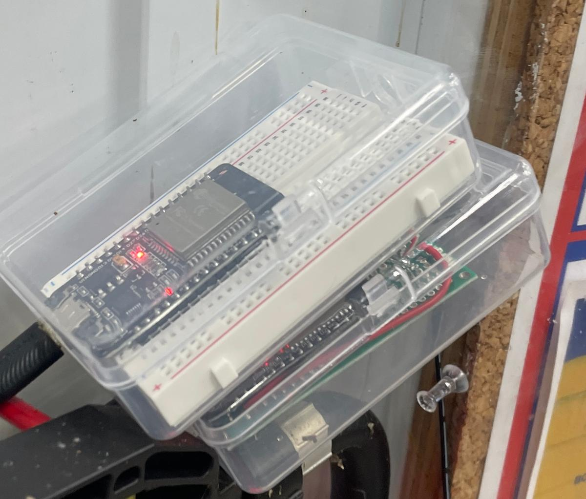

# ESP32 Honey Tank Monitor

A wireless IoT monitoring system using 5 ESP32 microcontrollers with ESP-NOW communication for real-time honey tank level detection and automated alerting.

## System Overview

- **3 Sensor MCUs**: Battery-powered ultrasonic sensors with deep sleep (120s cycles)
- **1 Siren MCU**: Always-on controller for audio alerts with per-tank snooze logic
- **1 Webserver MCU**: Wi-Fi connected web interface with REST API for monitoring and control
- **Communication**: ESP-NOW wireless protocol (unencrypted, low-latency)
- **Sensors**: A02YYUW ultrasonic sensors via UART
- **Power**: Battery sensors + mains-powered siren/webserver

## Features

### Sensor Nodes
- Ultra-low power design with 120-second deep sleep cycles
- Median filtering over 5-second sampling windows
- CRC-8 packet validation and collision avoidance
- Battery voltage monitoring
- At-risk detection when liquid level ≤ 6cm from tank top

### Siren Controller  
- Non-blocking 5-second audio pulse alerts
- Per-tank snooze functionality (5 minutes default)
- Custom snooze durations (10min, 20min, 1hr)
- Remote commands: FORCE_ON, FORCE_OFF, CLEAR_SNOOZE
- Continuous packet listening

### Web Interface
- Real-time tank status with fill percentages
- Battery voltage display and last-update timestamps  
- Integrated siren control panel
- REST API endpoints for status and commands
- NTP time synchronization
- Responsive single-page design

## Project Photos

### Deployed System


*Weatherproof sensor enclosure with ESP32 and A02YYUW ultrasonic sensor*


*Internal layout showing ESP32, sensor connections, and battery pack*



*Webserver MCU and siren controller with audio alert system*

### Web Interface


*Real-time web interface showing tank levels, battery status, and siren controls*


## Hardware Requirements

### Per Sensor MCU (3 units):
- ESP32 development board
- A02YYUW ultrasonic sensor
- Battery pack (voltage monitoring optional)
- Weatherproof enclosure

### Siren MCU (1 unit):
- ESP32 development board  
- Audio siren/buzzer
- IRLZ44N MOSFET for siren control
- Mains power supply

### Webserver MCU (1 unit):
- ESP32 development board
- Wi-Fi connection to home network
- Mains power supply

## Setup Instructions

### 1. Get MAC Addresses
Each ESP32 has a unique MAC address needed for ESP-NOW communication.

1. Upload `utilities/mac_address_finder/` sketch to each ESP32
2. Open Serial Monitor (115200 baud) 
3. Record the **STA MAC address** for each board
4. Label each board (e.g., "Sensor 1", "Sensor 2", "Siren", "Webserver")

### 2. Configure Project Files

Update the following MAC address arrays in each project:

**In `siren_mcu/src/main.cpp` and `webserver_mcu/src/main.cpp`:**
```cpp
static const uint8_t MAC_SENSORS[3][6] = {
  {0x78,0x1C,0x3C,0xB7,0xD1,0x50}, // Replace with Sensor 1 STA MAC
  {0xCC,0xDB,0xA7,0x95,0xB0,0x54}, // Replace with Sensor 2 STA MAC  
  {0x10,0x06,0x1C,0xF6,0x31,0x24}  // Replace with Sensor 3 STA MAC
};
```

**In `sensor_mcu/src/main.cpp`:**
```cpp
static const uint8_t MAC_SIREN[6]     = {0x6C,0xC8,0x40,0x4E,0x00,0x3C}; // Replace with Siren STA MAC
static const uint8_t MAC_WEBSERVER[6] = {0xCC,0xDB,0xA7,0x92,0xC2,0xB8}; // Replace with Webserver STA MAC
```

**In `webserver_mcu/src/main.cpp`:**
```cpp
static const uint8_t MAC_SIREN[6] = {0x6C,0xC8,0x40,0x4E,0x00,0x3C}; // Replace with Siren STA MAC

// Update Wi-Fi credentials:
const char* WIFI_SSID = "YOUR_WIFI_SSID";     // Replace with your network name
const char* WIFI_PASS = "YOUR_WIFI_PASSWORD"; // Replace with your password
```

### 3. Set Tank IDs
Each sensor needs a unique tank ID (0, 1, or 2).

In `sensor_mcu/src/main.cpp`, update the build flag:
```cpp
#ifndef TANK_ID
#define TANK_ID 0  // Change to 0, 1, or 2 for each sensor
#endif
```

Or set in `platformio.ini`:
```ini
build_flags = -DTANK_ID=0  ; Use 0, 1, or 2
```

### 4. Hardware Connections

**Sensor MCU:**
- A02YYUW VCC → 5V
- A02YYUW GND → GND  
- A02YYUW TX → GPIO 5 (ESP32 RX)
- A02YYUW RX → GPIO 18 (ESP32 TX)

**Siren MCU:**
- Siren + → 12V power supply +
- Siren - → IRLZ44N Drain
- IRLZ44N Source → 12V power supply -
- IRLZ44N Gate → GPIO 25 (via 220Ω resistor)

### 5. Deploy and Test

1. Upload code to each MCU using PlatformIO
2. Power on all devices
3. Check serial monitors for connection status
4. Access web interface at the IP shown in webserver serial output
5. Test siren functionality from web interface

## Network Configuration

- Siren MCU operates on Wi-Fi channel 1 (fixed)
- Webserver MCU connects to your Wi-Fi network
- Sensor MCUs scan for the network channel and adapt automatically
- All ESP-NOW communication uses the same channel as your Wi-Fi network

## API Endpoints

- `GET /` - Web interface
- `GET /api/status` - Tank status JSON
- `POST /api/siren` - Siren control commands

### Siren Commands:
```json
{"action": "test"}           // 5-second test pulse
{"action": "snooze_10m"}     // Snooze 10 minutes  
{"action": "snooze_20m"}     // Snooze 20 minutes
{"action": "snooze_1h"}      // Snooze 1 hour
{"action": "clear_snooze"}   // Clear all snoozes
```

## Troubleshooting

### Sensor not appearing in web interface:
1. Check MAC addresses are correctly configured
2. Verify sensor is waking up (check serial output)
3. Ensure all devices on same Wi-Fi channel
4. Check battery level on sensor MCU

### Webserver not receiving packets:
1. Verify Wi-Fi credentials and connection
2. Check ESP-NOW initialization in serial output  
3. Ensure webserver and network on same channel
4. Look for power save disable confirmation

### Siren not triggering:
1. Test siren using web interface first
2. Check threshold distance (≤ 6cm default)
3. Verify snooze status hasn't been activated
4. Check siren MCU serial output for packet reception

### Contact
Reach out to me at stiles.jesus.engineering@gmail.com if you need help using the code

## License

MIT License - See LICENSE file for details

## Contributing

Pull requests welcome. Please ensure all MAC addresses and credentials are replaced with placeholders before submitting.
